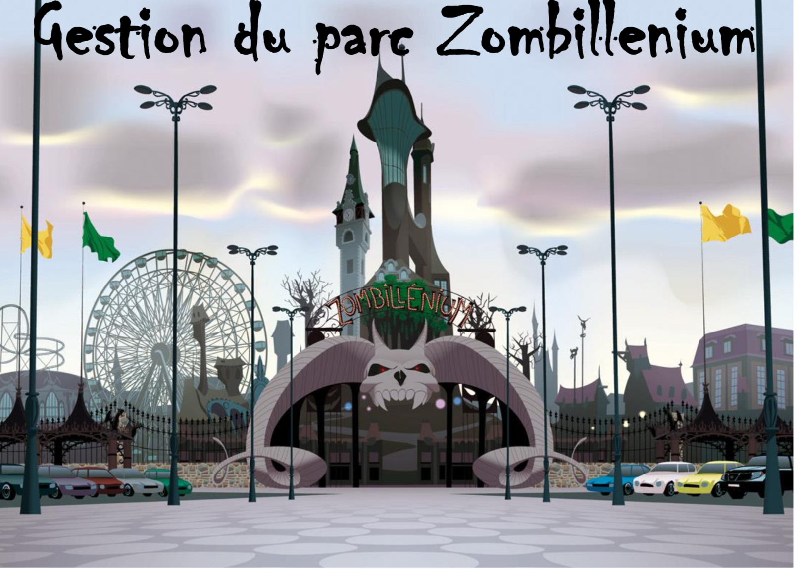

#  👽 Zombilenium  👽

# Introduction

As part of the Object Oriented Programming (POOI) module, it is possible to realize a project capable of managing the administration of a fictitious theme park. On this occasion, I had to offer a demonstration of this management software.
I then structured this project into several classes, to know more about it, a personal abstract class that will be the mother class of any type: Sorcerer, and a mother class Monster that gathers all types of monsters in the park (Vampire, Zombie, Wolf Garou etc.). I have also created an abstract parent class grouping all the types of attractions told in the park (Dark Ride, Roller Coaster, etc.). Finally, I created the administrative class in which all operations are handled.

## Our software allows us:

- Read a csv file containing staff members and attractions, and add them to the software.

- Add new attractions, new staff member.
- To be able to "evolve" staff members and attractions (change of function, assignment, maintenance ...). For each evolution that you consider important to consider, you will need to create a method.
- To be able to output several elements (attractions or personal) according to criteria given in console output, but also in a csv file.
- To be able to sort elements according to a given parameter (the zombies according to their kitty, the demons according to their strength, …).
- To be able to act on the kitty of the monsters: to increase it or to decrement it. It's Rose Von Bloodt who has been in charge since the beginning of the management of the kitty, sometimes quite obscure, it must be said. Your software will just give it a tool to add or remove any points it deems necessary.
- To be able to manage the modifications generated by the pot, namely:
  If a monster's kitty falls below 50, it is automatically assigned to a cotton candy stand. If the pot of zombies or demons exceeds 500, they get temporarily (it depends on their kitty) the power to disappear. As such, they are no longer assigned to a specific attraction (unless it lacks staff of course), but must walk around the park and scare visitors.

